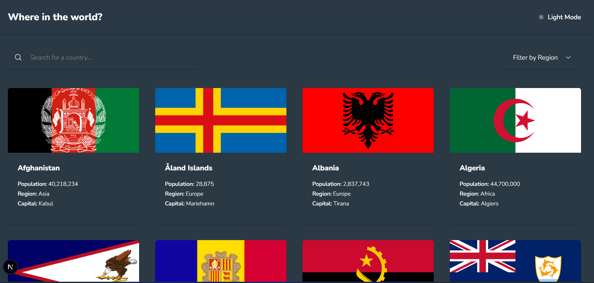

# REST Countries API with Color Theme Switcher



A responsive web application that displays information about countries around the world using the REST Countries API data. This project is built with Next.js, TypeScript, and Tailwind CSS.

## Features

- **Responsive Design**: Mobile-first approach that works on all device sizes
- **Dark/Light Theme**: Toggle between dark and light mode with persistent theme preference
- **Country Search**: Search for countries by name or capital
- **Region Filter**: Filter countries by region (Africa, Americas, Asia, Europe, Oceania)
- **Detailed Country Information**: View detailed information about each country including:
  - Flag
  - Native name
  - Population
  - Region
  - Sub-region
  - Capital
  - Top Level Domain
  - Currencies
  - Languages
  - Border countries
- **Accessible Navigation**: Fixed header that stays at the top when scrolling
- **Border Country Navigation**: Easily navigate to neighboring countries
- **Loading States**: Visual feedback during data fetching
- **Error Handling**: Graceful error handling for failed API requests

## Technologies Used

- **Next.js 15**: React framework for server-side rendering and static site generation
- **TypeScript**: For type safety and better developer experience
- **Tailwind CSS**: For styling and responsive design
- **React Hooks**: For state management and side effects
- **Next.js API Routes**: For serving country data
- **Local Data**: Using a local JSON file for country data to avoid rate limiting

## Getting Started

### Prerequisites

- Node.js 18.x or later
- npm or yarn

### Installation

1. Clone the repository:
   ```bash
   git clone https://github.com/yourusername/rest-countries-app.git
   cd rest-countries-app
   ```

2. Install dependencies:
   ```bash
   npm install
   # or
   yarn install
   ```

3. Run the development server:
   ```bash
   npm run dev
   # or
   yarn dev
   ```

4. Open [http://localhost:3000](http://localhost:3000) in your browser to see the application.

## Project Structure

```
rest-countries-app/
├── public/                # Static files
├── src/
│   ├── app/               # Next.js app directory
│   │   ├── api/           # API routes
│   │   ├── country/       # Country detail pages
│   │   └── page.tsx       # Home page
│   ├── components/        # React components
│   ├── styles/            # Global styles
│   └── types/             # TypeScript type definitions
├── data.json              # Country data
├── next.config.js         # Next.js configuration
├── postcss.config.js      # PostCSS configuration
├── tailwind.config.js     # Tailwind CSS configuration
└── tsconfig.json          # TypeScript configuration
```

## Key Components

- **Header**: Contains the application title and theme toggle
- **SearchFilter**: Provides search and region filtering functionality
- **CountryList**: Displays the list of countries based on search and filter criteria
- **CountryCard**: Card component for each country in the list
- **CountryDetail**: Detailed view of a specific country
- **ThemeProvider**: Context provider for theme management

## Deployment

This application can be easily deployed to platforms like Vercel or Netlify:

```bash
# Build for production
npm run build
# or
yarn build

# Start production server
npm start
# or
yarn start
```

## Credits

- Design by [Frontend Mentor](https://www.frontendmentor.io/)
- Country data from [REST Countries API](https://restcountries.com/)
- Icons from [Heroicons](https://heroicons.com/)

## License

This project is open source and available under the [MIT License](LICENSE).
